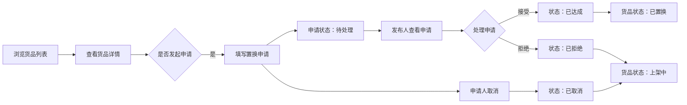

## 1. 产品概述

二手货品置换平台是一个轻量级的物品交换服务，让用户能够发布闲置物品并与其他用户进行置换交易。平台围绕本地模拟数据打通核心流程，实现货品的浏览、发布、申请置换和状态管理。

- 主要目的：为用户提供便捷的闲置物品置换渠道，减少资源浪费
- 解决的问题：传统二手交易需要现金支付，置换模式更灵活
- 目标用户：有闲置物品希望置换的本地用户
- 产品价值：降低交易成本，促进资源循环利用

## 2. 核心功能

### 2.1 用户角色

| 角色 | 注册方式 | 核心权限 |
|------|----------|----------|
| 普通用户 | 模拟登录（无实际登录） | 浏览货品、发布货品、编辑货品、发起置换申请、处理置换申请 |

### 2.2 功能模块

1. **货品列表页**：货品卡片展示、搜索筛选、统计概览
2. **货品详情页**：货品信息展示、置换申请记录、状态操作
3. **发布/编辑页**：表单提交、数据校验、状态切换
4. **统计区域**：实时数据统计、状态数量展示
5. **置换申请管理**：申请发起、接受、拒绝、取消状态流转

### 2.3 页面详情

| 页面名称 | 模块名称 | 功能描述 |
|-----------|----------|----------|
| 货品列表页 | 统计概览 | 展示上架中、待处理申请、已达成置换、已下架数量 |
| 货品列表页 | 搜索筛选 | 按关键词、品类、城市、状态过滤 |
| 货品列表页 | 货品卡片 | 展示标题、品类、成色、城市、期望置换物、发布人、状态 |
| 货品详情页 | 基本信息 | 展示描述、图片占位、交换条件 |
| 货品详情页 | 申请记录 | 展示历史申请及当前处理状态 |
| 货品详情页 | 状态操作 | 发起、接受、拒绝、取消置换申请 |
| 发布/编辑页 | 表单模块 | 货品信息录入、表单校验 |
| 发布/编辑页 | 状态切换 | 上架/下架状态切换 |

## 3. 核心流程

用户浏览货品列表 → 查看货品详情 → 发起置换申请 → 发布人处理申请 → 申请接受/拒绝 → 状态同步更新

## 4. 用户界面设计

### 4.1 设计风格

- **主色调**：采用温暖的橙色系 (#FF8C42)，传递友好、活力的氛围
- **辅助色**：深灰色系 (#2C3E50) 用于文字和边框，绿色 (#27AE60) 表示成功，红色 (#E74C3C) 表示警告
- **按钮风格**：圆角矩形，微阴影，hover 时有轻微上浮效果
- **字体**：使用系统无衬线字体，标题 18-24px，正文 14px，辅助文字 12px
- **布局风格**：卡片式布局，顶部导航栏，侧边统计面板
- **图标风格**：简洁线性图标，使用 emoji 增强视觉识别

### 4.2 页面设计概述

| 页面名称 | 模块名称 | UI 元素 |
|-----------|----------|----------|
| 货品列表页 | 顶部导航 | 品牌 Logo、发布按钮、搜索框 |
| 货品列表页 | 统计面板 | 四个统计卡片，不同颜色区分状态 |
| 货品列表页 | 筛选区域 | 品类、城市、状态下拉选择器 |
| 货品列表页 | 货品网格 | 响应式卡片网格，hover 效果 |
| 货品详情页 | 详情头部 | 货品大图占位、基本信息概览 |
| 货品详情页 | 信息区域 | 标签展示描述、成色、城市等 |
| 货品详情页 | 申请记录 | 时间线样式的申请历史 |
| 货品详情页 | 操作区域 | 根据状态显示可用操作按钮 |
| 发布/编辑页 | 表单区域 | 分组表单，标签 + 输入框 |
| 发布/编辑页 | 操作按钮 | 保存、取消、删除按钮 |

### 4.3 响应性

- 采用桌面优先设计，自适应布局
- 使用 CSS Grid 和 Flexbox 实现响应式
- 移动端适配：单列布局，汉堡菜单
- 触摸优化：按钮最小 44px，便于点击

### 4.4 动效设计

- 页面加载时的渐入动画
- 卡片 hover 时的轻微上浮和阴影加深
- 状态切换时的平滑过渡
- 表单提交成功后的反馈动效
