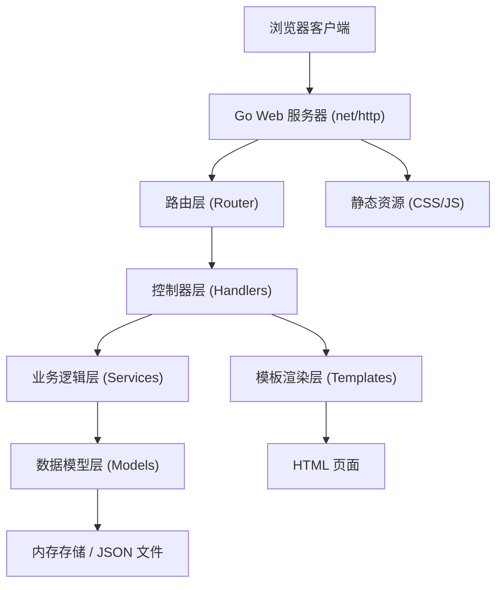
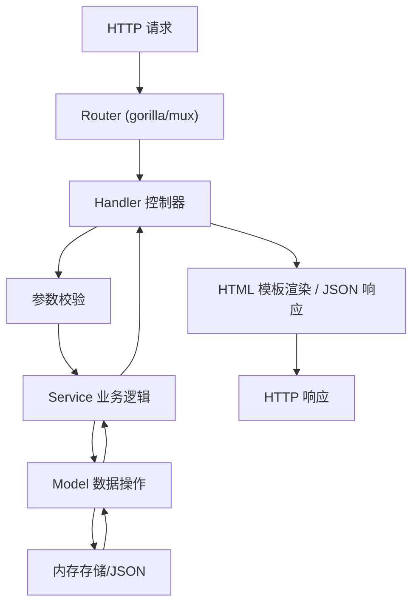
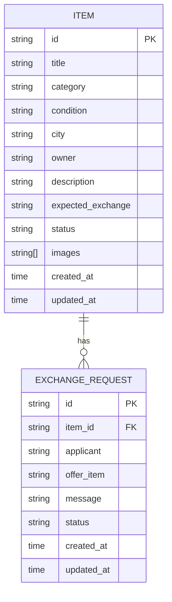

## 1. 架构设计



## 2. 技术描述

- **后端**：Go 1.20+ 标准库 net/http + html/template，轻量无第三方 Web 框架依赖
- **模板引擎**：Go 内置 html/template
- **数据存储**：本地内存存储 + JSON 文件持久化（无需真实数据库）
- **前端**：原生 HTML5 + CSS3 + 原生 JavaScript (ES6+)，无前端框架依赖
- **样式方案**：自定义 CSS 变量，响应式布局
- **初始化工具**：手动创建 Go 模块结构

## 3. 项目结构

```
.
├── main.go                    # 应用入口
├── go.mod
├── go.sum
├── data/
│   └── mock_data.json         # 模拟数据持久化文件
├── internal/
│   ├── models/                # 数据模型层
│   │   └── models.go
│   ├── services/              # 业务逻辑层
│   │   ├── item_service.go
│   │   ├── exchange_service.go
│   │   └── stats_service.go
│   ├── handlers/              # 控制器层
│   │   ├── item_handler.go
│   │   ├── exchange_handler.go
│   │   └── stats_handler.go
│   └── router/                # 路由层
│       └── router.go
├── templates/                 # HTML 模板
│   ├── layout.html
│   ├── index.html
│   ├── detail.html
│   └── form.html
└── static/                    # 静态资源
    ├── css/
    │   └── style.css
    └── js/
        └── app.js
```

## 4. 路由定义

| 路由 | 方法 | 用途 |
|------|------|------|
| `/` | GET | 货品列表页（含统计和筛选） |
| `/items/{id}` | GET | 货品详情页 |
| `/items/new` | GET | 新建货品表单页 |
| `/items/new` | POST | 提交新建货品 |
| `/items/{id}/edit` | GET | 编辑货品表单页 |
| `/items/{id}/edit` | POST | 提交编辑货品 |
| `/items/{id}/delete` | POST | 删除货品（下架） |
| `/exchange/apply` | POST | 发起置换申请 |
| `/exchange/{id}/accept` | POST | 接受置换申请 |
| `/exchange/{id}/reject` | POST | 拒绝置换申请 |
| `/exchange/{id}/cancel` | POST | 取消置换申请 |
| `/api/stats` | GET | 获取统计数据（JSON API） |
| `/static/*` | GET | 静态资源服务 |

## 5. API 定义

### 5.1 统计数据 API

**GET /api/stats**

响应结构：
```go
type StatsResponse struct {
    OnSaleCount     int `json:"on_sale_count"`
    PendingCount    int `json:"pending_count"`
    CompletedCount  int `json:"completed_count"`
    OfflineCount    int `json:"offline_count"`
}
```

### 5.2 置换申请操作

**POST /exchange/apply**

请求结构：
```go
type ApplyRequest struct {
    ItemID      string `json:"item_id" form:"item_id"`
    Applicant   string `json:"applicant" form:"applicant"`
    OfferItem   string `json:"offer_item" form:"offer_item"`
    Message     string `json:"message" form:"message"`
}
```

## 6. 服务器架构图



## 7. 数据模型

### 7.1 ER 图



### 7.2 数据结构定义

```go
// 货品状态枚举
const (
    ItemStatusOnSale    = "on_sale"    // 上架中
    ItemStatusPending   = "pending"    // 待处理（有申请未处理）
    ItemStatusCompleted = "completed"  // 已置换
    ItemStatusOffline   = "offline"    // 已下架
)

// 置换申请状态枚举
const (
    ExchangeStatusPending = "pending"  // 待处理
    ExchangeStatusAccepted = "accepted" // 已接受
    ExchangeStatusRejected = "rejected" // 已拒绝
    ExchangeStatusCanceled = "canceled" // 已取消
)

// 货品模型
type Item struct {
    ID              string    `json:"id"`
    Title           string    `json:"title"`
    Category        string    `json:"category"`
    Condition       string    `json:"condition"`
    City            string    `json:"city"`
    Owner           string    `json:"owner"`
    Description     string    `json:"description"`
    ExpectedExchange string   `json:"expected_exchange"`
    Status          string    `json:"status"`
    Images          []string  `json:"images"`
    CreatedAt       time.Time `json:"created_at"`
    UpdatedAt       time.Time `json:"updated_at"`
}

// 置换申请模型
type ExchangeRequest struct {
    ID         string    `json:"id"`
    ItemID     string    `json:"item_id"`
    Applicant  string    `json:"applicant"`
    OfferItem  string    `json:"offer_item"`
    Message    string    `json:"message"`
    Status     string    `json:"status"`
    CreatedAt  time.Time `json:"created_at"`
    UpdatedAt  time.Time `json:"updated_at"`
}

// 统计数据模型
type Statistics struct {
    OnSaleCount    int `json:"on_sale_count"`
    PendingCount   int `json:"pending_count"`
    CompletedCount int `json:"completed_count"`
    OfflineCount   int `json:"offline_count"`
}
```

### 7.3 品类和城市常量

```go
// 可选品类
var Categories = []string{"数码电子", "图书文具", "家居用品", "服饰鞋帽", "运动户外", "母婴用品", "其他"}

// 可选成色
var Conditions = []string{"全新", "几乎全新", "轻微使用", "明显使用", "功能正常"}

// 可选城市
var Cities = []string{"北京", "上海", "广州", "深圳", "杭州", "成都", "武汉", "南京", "西安", "重庆"}
```
